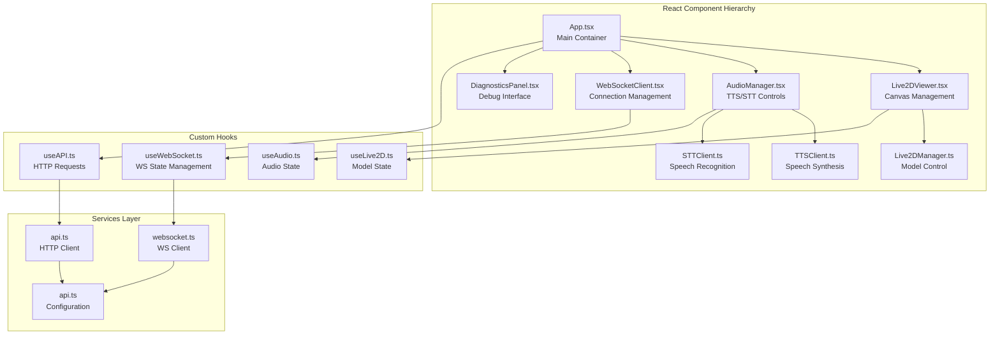
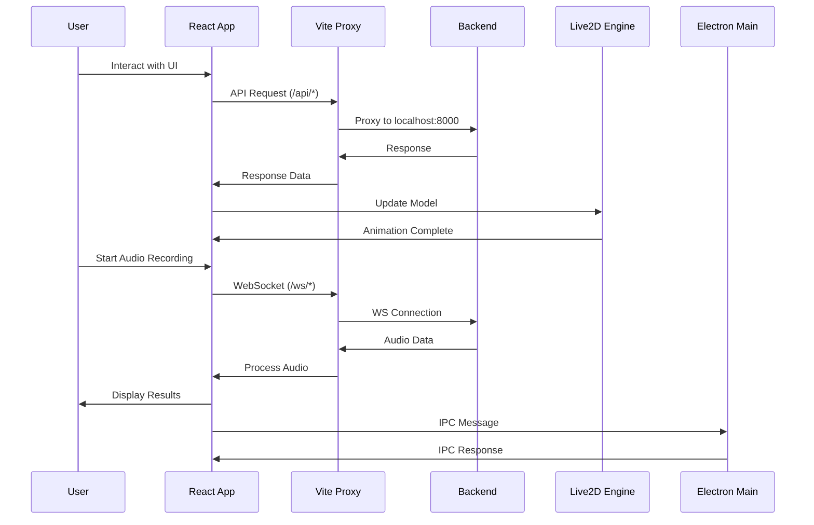
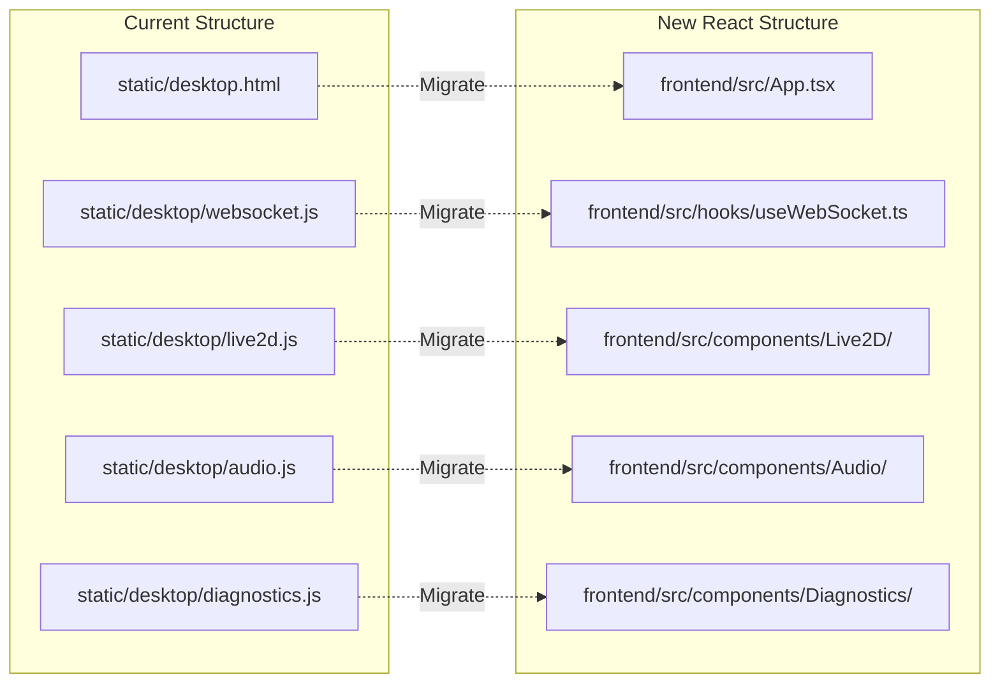
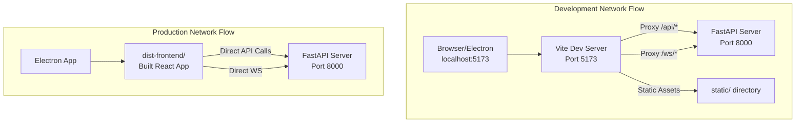
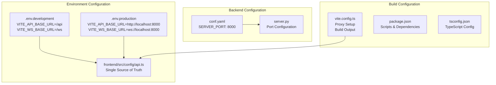
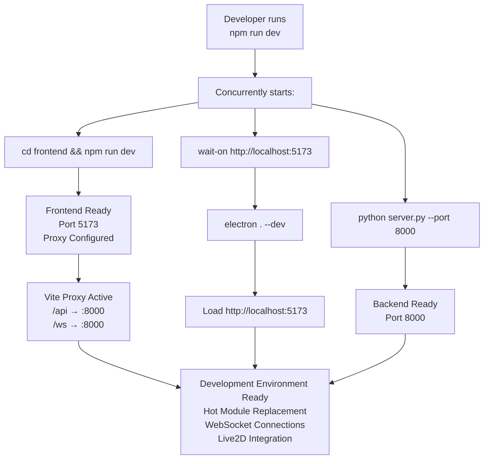
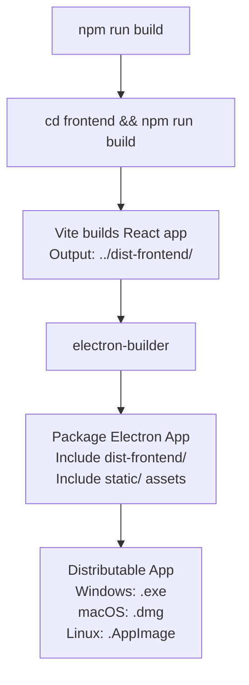

# AWS Live2D Assistant - React + Vite Architecture

## System Architecture Overview

```mermaid
graph TB
    subgraph "Development Environment"
        DEV[Developer]
        DEV --> CMD[npm run dev]
    end
    
    subgraph "Concurrent Processes"
        CMD --> BE[Backend Server<br/>Python FastAPI<br/>Port 8000]
        CMD --> FE[Frontend Dev Server<br/>Vite + React<br/>Port 5173]
        CMD --> EL[Electron Main Process<br/>BrowserWindow]
    end
    
    subgraph "Frontend (React + Vite)"
        FE --> PROXY[Vite Proxy]
        PROXY --> |/api/*| BE
        PROXY --> |/ws/*| BE
        
        FE --> REACT[React App]
        REACT --> LIVE2D[Live2D Viewer]
        REACT --> AUDIO[Audio Manager]
        REACT --> WS[WebSocket Client]
        REACT --> DIAG[Diagnostics Panel]
    end
    
    subgraph "Backend (FastAPI)"
        BE --> HEALTH[/health endpoint]
        BE --> WSECHO[/ws/echo WebSocket]
        BE --> MOCKTTS[/api/tts/mock]
        BE --> MOCKSTT[/api/stt/mock]
        BE --> MAINWS[/client-ws WebSocket]
        BE --> CORS[CORS Middleware]
    end
    
    subgraph "Electron Integration"
        EL --> |Development| DEVLOAD[Load http://localhost:5173]
        EL --> |Production| PRODLOAD[Load dist-frontend/index.html]
        EL --> IPC[IPC Communication]
        EL --> PRELOAD[Preload Scripts]
    end
    
    subgraph "Static Assets"
        STATIC[static/ directory]
        STATIC --> MODELS[Live2D Models]
        STATIC --> LIBS[Live2D Libraries]
        STATIC --> ASSETS[Audio/Image Assets]
        
        REACT --> |Access via Vite| STATIC
    end
    
    subgraph "Build Process"
        BUILD[npm run build]
        BUILD --> FEBUILD[Frontend Build<br/>Vite → dist-frontend/]
        BUILD --> ELBUILD[Electron Build<br/>electron-builder]
        FEBUILD --> ELBUILD
    end
```

## Component Architecture



## Data Flow Architecture



## File Structure Mapping



## Network Architecture



## Configuration Management



## Development Workflow



## Build and Deployment Flow



## Key Integration Points

### 1. Vite Proxy Configuration
- **Development**: Routes `/api/*` and `/ws/*` to `localhost:8000`
- **Production**: Direct API calls to configured backend URL
- **Asset Serving**: Static Live2D assets served through Vite

### 2. WebSocket Handling
- **Development**: Proxy WebSocket connections through Vite
- **Production**: Direct WebSocket connections to backend
- **Reconnection**: Automatic reconnection logic in React hooks

### 3. Live2D Integration
- **Asset Loading**: Live2D models and libraries served as static assets
- **React Integration**: Canvas management through React refs
- **State Management**: Live2D state managed through React hooks

### 4. Electron Integration
- **Development**: Load Vite dev server URL
- **Production**: Load built React app files
- **IPC**: Maintain existing IPC communication patterns

This architecture ensures a clean separation of concerns while maintaining all existing functionality and providing a modern, maintainable development experience.