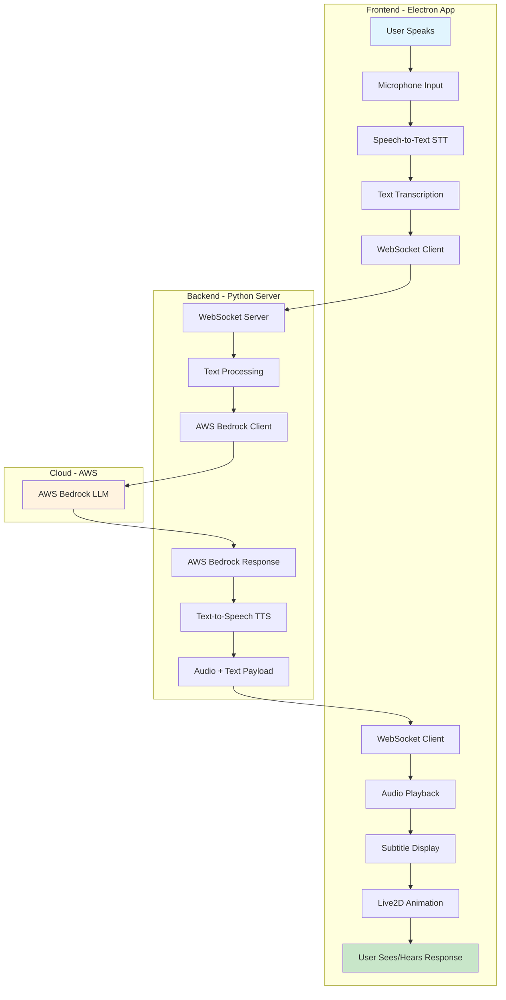
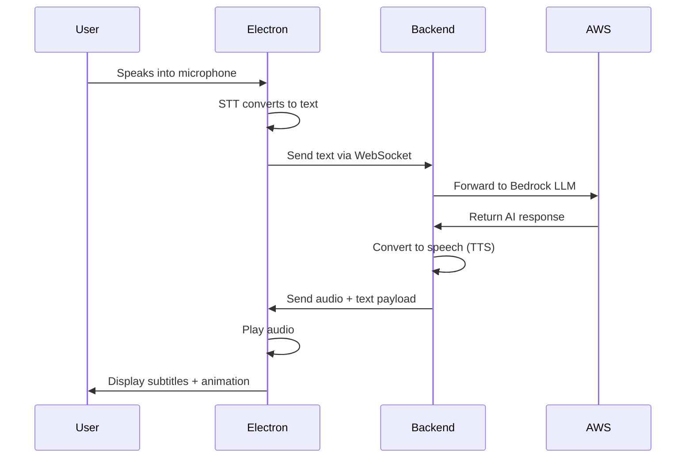

# VTuber Application Architecture

## System Overview
This application creates an interactive AI VTuber assistant using a multi-tier architecture that combines Electron for the frontend, Python for the backend, and AWS Bedrock for AI processing.

## Architecture Flow Diagram



## Detailed Component Breakdown

### 1. Frontend (Electron Application)
**Location**: `LLM-Live2D-Desktop-Assitant-main/static/desktop/`

#### Components:
- **Live2D Model Display**: Visual representation of the VTuber character
- **Speech Recognition (STT)**: Converts user's voice to text
  - File: `vad.js` - Voice Activity Detection
  - Uses Whisper model for transcription
- **WebSocket Client**: Maintains real-time connection with backend
  - File: `websocket.js`
- **Audio Player**: Plays TTS responses
  - File: `audio.js`
- **Subtitle Handler**: Displays text responses
  - File: `subtitle-handler.js`

### 2. Backend (Python Server)
**Location**: `LLM-Live2D-Desktop-Assitant-main/server.py`

#### Components:
- **WebSocket Server**: Handles bidirectional communication
  - Port: 8002 (configurable)
- **LLM Integration**: Connects to AWS Bedrock
  - Model: Claude Opus
- **Text-to-Speech Engine**: Converts LLM responses to audio
  - Engine: EdgeTTS
  - Output: MP3 format
- **Audio Payload Preparation**: Packages audio + metadata
  - File: `tts/stream_audio.py`

### 3. Cloud Services (AWS)
- **AWS Bedrock**: Provides LLM capabilities
  - Model: Claude Opus 4.1
  - Region: us-west-2

## Data Flow Sequence



## Message Format

### Frontend to Backend:
```json
{
  "type": "mic-audio-data",
  "audio": "base64_encoded_audio"
}
// or
{
  "type": "text-input",
  "text": "User's message"
}
```

### Backend to Frontend:
```json
{
  "type": "audio-payload",
  "audio": "base64_encoded_mp3",
  "text": "Response text for subtitles",
  "expression_list": ["joy", "neutral"],
  "volumes": [0.5, 0.7, ...],
  "slice_length": 0.1,
  "format": "mp3"
}
```

## Key Technologies

| Component | Technology | Purpose |
|-----------|------------|---------|
| Frontend Framework | Electron | Desktop application |
| UI Rendering | HTML/CSS/JavaScript | User interface |
| Character Animation | Live2D | VTuber model |
| Speech Recognition | Whisper (Faster-Whisper) | Voice to text |
| Backend Framework | FastAPI | WebSocket server |
| AI Model | AWS Bedrock Claude | Natural language processing |
| Text-to-Speech | EdgeTTS | Voice synthesis |
| Communication | WebSocket | Real-time bidirectional |

## Configuration Files

- **Backend Config**: `.env` file
  - AWS credentials
  - Model selection
  - Voice settings
  
- **Frontend Config**: `package.json`
  - Electron settings
  - Dependencies

## Performance Considerations

1. **Latency Optimization**:
   - WebSocket for real-time communication
   - Audio streaming while generating
   - Cached TTS responses

2. **Resource Management**:
   - Audio queue system
   - Proper WebSocket lifecycle
   - Memory-efficient audio handling

## Security Notes

- AWS credentials stored in `.env` file
- WebSocket runs on localhost only
- No external network exposure by default

## Recent Fixes Applied

1. **Audio Playback Fix**:
   - Corrected message type mismatch
   - Fixed property naming conventions
   - Added MP3 format support

2. **WebSocket Stability**:
   - Improved reconnection logic
   - Better error handling
   - Rate limiting for commands

This architecture provides a robust, scalable foundation for an AI-powered VTuber assistant with real-time voice interaction capabilities.