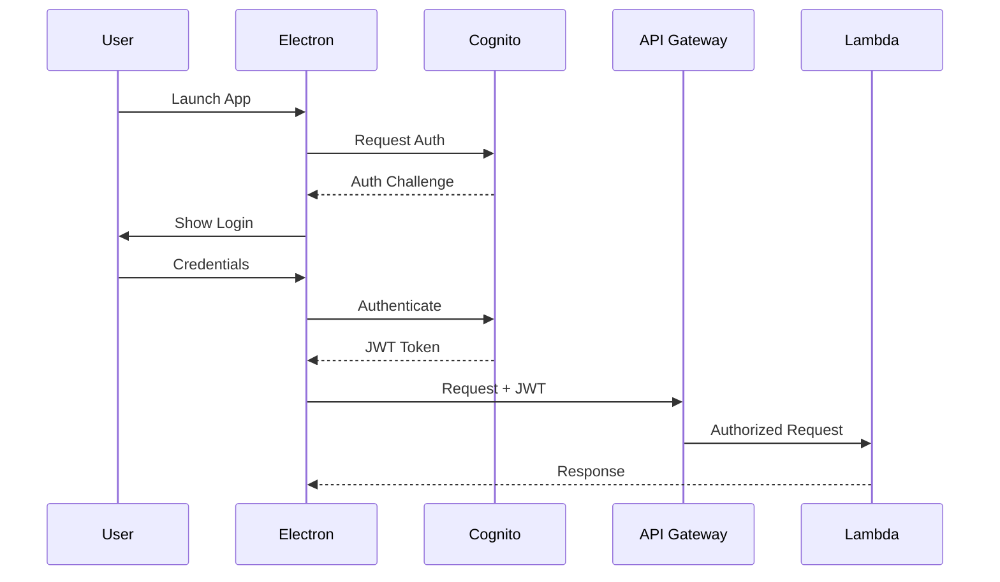

# AWS Migration Plan - LLM-Live2D-Desktop-Assistant

## Executive Summary

This document outlines the migration strategy for transitioning the LLM-Live2D-Desktop-Assistant from a hybrid local/cloud architecture to a fully AWS-native solution. The migration will improve scalability, reduce operational overhead, and enable global deployment while maintaining low-latency user experience.

## Current State Analysis

### Architecture Overview
- **Frontend**: Electron desktop application with Live2D avatar
- **Backend**: Local Python FastAPI server (port 1018)
- **AI Integration**: AWS Bedrock Claude (already cloud-based)
- **Speech Processing**: Local Whisper ASR and Edge TTS
- **Communication**: WebSocket for real-time interaction

### Critical Issues Requiring Immediate Attention

1. **🔴 Security Vulnerability**: Python code injection in `src/main/ipc.js:296`
   - **Risk**: High - Remote code execution possible
   - **Fix Required**: Input sanitization before cloud deployment

2. **🔴 Missing Wake Word Files**: English wake word file not found
   - **Impact**: Feature unavailable for English users
   - **Solution**: Implement AWS Lex or fix file references

3. **⚠️ Missing Function**: `resolveModel3Path` undefined in `src/main/ipc.js:253`
   - **Impact**: Runtime errors in model loading
   - **Solution**: Implement function or use existing model resolution

## Target AWS Architecture

### Recommended: Serverless-First Approach

```
┌─────────────────────────────────────────────────────────────┐
│                         User Desktop                         │
│  ┌─────────────────────────────────────────────────────┐   │
│  │            Electron App (Live2D UI)                  │   │
│  └──────────────────┬───────────────────────────────────┘   │
└────────────────────┼────────────────────────────────────────┘
                      │
                      ▼
┌─────────────────────────────────────────────────────────────┐
│                        AWS Cloud                             │
│                                                              │
│  ┌──────────────────────────────────────────────────────┐  │
│  │                    Edge Layer                         │  │
│  │  ┌──────────────┐    ┌─────────────────────────┐    │  │
│  │  │  CloudFront  │    │      AWS WAF           │    │  │
│  │  │     CDN      │    │  (DDoS Protection)     │    │  │
│  │  └──────────────┘    └─────────────────────────┘    │  │
│  └──────────────────────────────────────────────────────┘  │
│                                                              │
│  ┌──────────────────────────────────────────────────────┐  │
│  │                    API Layer                          │  │
│  │  ┌──────────────────────────────────────────────┐   │  │
│  │  │           API Gateway                         │   │  │
│  │  │  - WebSocket API (real-time)                 │   │  │
│  │  │  - REST API (control plane)                  │   │  │
│  │  └───────────────┬──────────────────────────────┘   │  │
│  │                  │                                    │  │
│  │  ┌───────────────▼──────────────────────────────┐   │  │
│  │  │         Cognito User Pools                    │   │  │
│  │  │      (Authentication & Authorization)         │   │  │
│  │  └──────────────────────────────────────────────┘   │  │
│  └──────────────────────────────────────────────────────┘  │
│                                                              │
│  ┌──────────────────────────────────────────────────────┐  │
│  │                  Compute Layer                        │  │
│  │  ┌─────────────────┐  ┌──────────────────────────┐  │  │
│  │  │  Lambda Functions│  │    Step Functions        │  │  │
│  │  │  - Orchestrator  │  │  (Workflow Management)   │  │  │
│  │  │  - Audio Process │  └──────────────────────────┘  │  │
│  │  │  - Session Mgmt  │                                │  │
│  │  └─────────────────┘                                 │  │
│  └──────────────────────────────────────────────────────┘  │
│                                                              │
│  ┌──────────────────────────────────────────────────────┐  │
│  │                    AI/ML Services                     │  │
│  │  ┌──────────────┐  ┌──────────────┐  ┌───────────┐ │  │
│  │  │   Bedrock    │  │  Transcribe  │  │   Polly   │ │  │
│  │  │   (Claude)   │  │    (ASR)     │  │   (TTS)   │ │  │
│  │  └──────────────┘  └──────────────┘  └───────────┘ │  │
│  └──────────────────────────────────────────────────────┘  │
│                                                              │
│  ┌──────────────────────────────────────────────────────┐  │
│  │                   Storage Layer                       │  │
│  │  ┌──────────────┐  ┌──────────────┐  ┌───────────┐ │  │
│  │  │   DynamoDB   │  │      S3      │  │ElastiCache│ │  │
│  │  │  (Sessions)  │  │   (Assets)   │  │  (Cache)  │ │  │
│  │  └──────────────┘  └──────────────┘  └───────────┘ │  │
│  └──────────────────────────────────────────────────────┘  │
└─────────────────────────────────────────────────────────────┘
```

## Migration Phases

### Phase 1: Foundation & Security (Week 1-2)
**Priority: Critical**

- [ ] Fix Python injection vulnerability in ipc.js
- [ ] Resolve missing wake word files issue
- [ ] Fix undefined function errors
- [ ] Set up AWS development environment
- [ ] Configure IAM roles and policies
- [ ] Deploy enhanced SAM template with Cognito
- [ ] Set up CloudFront distribution for static assets
- [ ] Configure S3 buckets with proper permissions

### Phase 2: Core Services Migration (Week 3-4)
**Priority: High**

- [ ] Migrate Python backend logic to Lambda functions
- [ ] Implement Amazon Transcribe for speech-to-text
- [ ] Implement Amazon Polly for text-to-speech
- [ ] Set up Step Functions for conversation workflow
- [ ] Migrate WebSocket handling to API Gateway
- [ ] Implement connection state management in DynamoDB
- [ ] Set up ElastiCache for session caching

### Phase 3: Integration & Testing (Week 5-6)
**Priority: High**

- [ ] Update Electron app to use AWS endpoints
- [ ] Implement proper authentication flow with Cognito
- [ ] Add retry logic and error handling
- [ ] Performance testing and optimization
- [ ] Security testing and vulnerability scanning
- [ ] Load testing with expected user volumes

### Phase 4: Monitoring & Optimization (Week 7-8)
**Priority: Medium**

- [ ] Set up CloudWatch dashboards
- [ ] Implement X-Ray tracing
- [ ] Configure alarms and notifications
- [ ] Optimize Lambda cold starts
- [ ] Implement cost monitoring
- [ ] Fine-tune auto-scaling policies

## Service Implementation Details

### 1. Lambda Functions Architecture

```javascript
// Orchestrator Lambda
exports.handler = async (event) => {
    const { connectionId, message } = event;
    
    // Process message
    const workflow = await startStepFunction({
        connectionId,
        message,
        timestamp: Date.now()
    });
    
    return { statusCode: 200, workflowId: workflow.executionArn };
};
```

### 2. Step Functions Workflow

```json
{
  "Comment": "Conversation processing workflow",
  "StartAt": "ProcessAudio",
  "States": {
    "ProcessAudio": {
      "Type": "Task",
      "Resource": "arn:aws:lambda:REGION:ACCOUNT:function:ProcessAudio",
      "Next": "TranscribeAudio"
    },
    "TranscribeAudio": {
      "Type": "Task", 
      "Resource": "arn:aws:states:::aws-sdk:transcribe:startTranscriptionJob",
      "Next": "InvokeClaude"
    },
    "InvokeClaude": {
      "Type": "Task",
      "Resource": "arn:aws:lambda:REGION:ACCOUNT:function:ClaudeHandler",
      "Next": "GenerateSpeech"
    },
    "GenerateSpeech": {
      "Type": "Task",
      "Resource": "arn:aws:states:::aws-sdk:polly:synthesizeSpeech",
      "Next": "SendResponse"
    },
    "SendResponse": {
      "Type": "Task",
      "Resource": "arn:aws:lambda:REGION:ACCOUNT:function:WebSocketResponse",
      "End": true
    }
  }
}
```

### 3. DynamoDB Schema

```yaml
ConnectionsTable:
  PartitionKey: connectionId (String)
  Attributes:
    - userId (String)
    - sessionId (String)
    - connectedAt (Number)
    - lastActivity (Number)
    
SessionsTable:
  PartitionKey: userId (String)
  SortKey: sessionId (String)
  Attributes:
    - messages (List)
    - context (Map)
    - createdAt (Number)
    - expiresAt (Number)
```

## Cost Estimation

### Monthly Cost Breakdown (1000 Daily Active Users)

| Service | Usage | Estimated Cost |
|---------|-------|----------------|
| API Gateway | 1M requests | $3.50 |
| Lambda | 500K invocations | $10.00 |
| DynamoDB | On-demand | $25.00 |
| S3 | 100GB storage | $2.30 |
| CloudFront | 1TB transfer | $85.00 |
| Bedrock Claude | 1M tokens | $15.00 |
| Transcribe | 1000 minutes | $24.00 |
| Polly | 1M characters | $4.00 |
| **Total** | | **~$169/month** |

### Cost Optimization Strategies

1. **Use Reserved Capacity** for predictable workloads
2. **Implement Caching** at multiple layers
3. **Optimize Lambda Memory** allocation
4. **Use S3 Intelligent-Tiering** for assets
5. **Enable API Gateway Caching** for repeated requests

## Security Implementation

### Authentication Flow



### Security Checklist

- [ ] Enable AWS WAF on API Gateway
- [ ] Implement request throttling
- [ ] Enable VPC endpoints for private communication
- [ ] Use Secrets Manager for API keys
- [ ] Enable GuardDuty for threat detection
- [ ] Implement least-privilege IAM policies
- [ ] Enable CloudTrail logging
- [ ] Set up Security Hub for compliance

## CI/CD Pipeline

### GitHub Actions Workflow

```yaml
name: Deploy to AWS
on:
  push:
    branches: [main]

jobs:
  deploy:
    runs-on: ubuntu-latest
    steps:
      - uses: actions/checkout@v2
      
      - name: Configure AWS credentials
        uses: aws-actions/configure-aws-credentials@v1
        with:
          aws-access-key-id: ${{ secrets.AWS_ACCESS_KEY_ID }}
          aws-secret-access-key: ${{ secrets.AWS_SECRET_ACCESS_KEY }}
          aws-region: us-west-2
      
      - name: SAM Build
        run: sam build
        
      - name: SAM Deploy
        run: |
          sam deploy \
            --no-confirm-changeset \
            --no-fail-on-empty-changeset \
            --stack-name live2d-assistant \
            --parameter-overrides Env=prod
```

## Monitoring Strategy

### Key Metrics to Track

1. **Performance Metrics**
   - Lambda cold start duration
   - API Gateway latency
   - WebSocket connection duration
   - Speech processing time

2. **Business Metrics**
   - Daily active users
   - Messages processed
   - Error rates by component
   - Cost per user session

3. **Alarms Configuration**
   - High error rate (>1%)
   - Lambda throttling
   - DynamoDB throttling
   - High latency (>2s)

## Rollback Strategy

1. **Blue-Green Deployment** using API Gateway stages
2. **Lambda Aliases** for version management
3. **CloudFormation Stack** rollback capability
4. **Database Backups** with point-in-time recovery
5. **Circuit Breakers** in application code

## Success Criteria

- [ ] All critical bugs fixed
- [ ] 99.9% uptime SLA achieved
- [ ] <2 second response latency p95
- [ ] Cost within 20% of estimate
- [ ] Zero security vulnerabilities
- [ ] Successful load test (1000 concurrent users)

## Next Steps

1. **Immediate Actions**
   - Fix critical security issues
   - Set up AWS development account
   - Create proof of concept for one component

2. **Week 1 Deliverables**
   - Security fixes deployed
   - Development environment ready
   - Migration plan approved

3. **Success Metrics**
   - Reduced operational overhead by 50%
   - Improved scalability (auto-scaling)
   - Global deployment capability
   - Enhanced security posture

## Appendices

### A. Enhanced SAM Template Structure
See `backend/template.yml` for the current implementation

### B. Migration Scripts
To be developed during Phase 1

### C. Testing Strategy
- Unit tests for Lambda functions
- Integration tests for Step Functions
- End-to-end tests for user flows
- Performance benchmarks

### D. Training Requirements
- AWS Lambda best practices
- Step Functions workflow design
- CloudWatch monitoring
- Security best practices

---

**Document Version**: 1.0
**Last Updated**: 2024-01-13
**Author**: AWS Migration Team
**Status**: Ready for Review