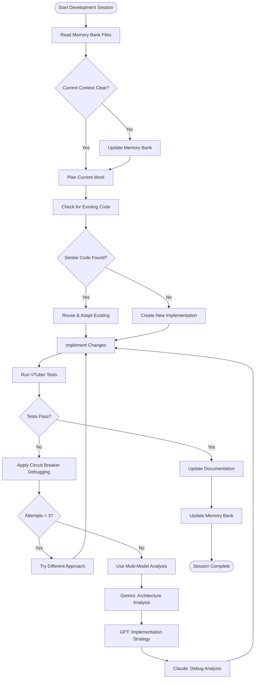
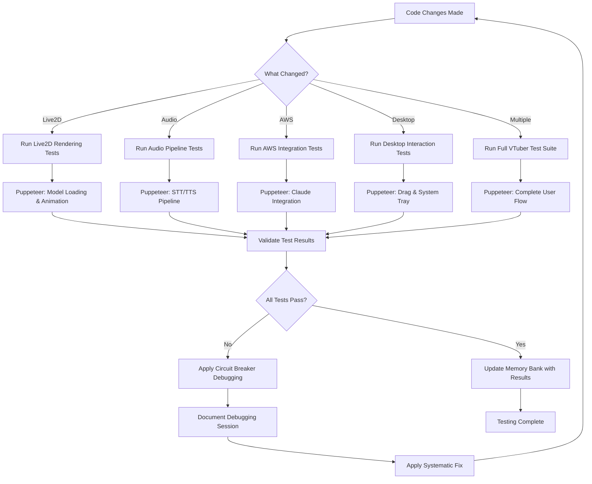
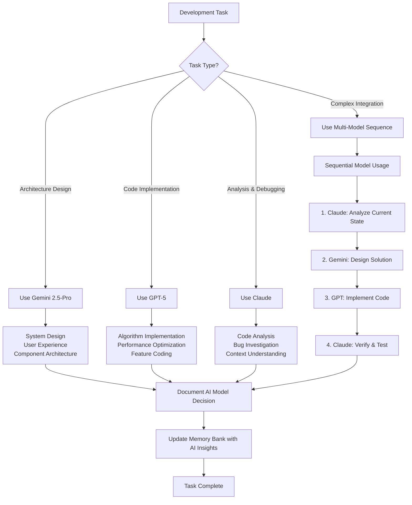
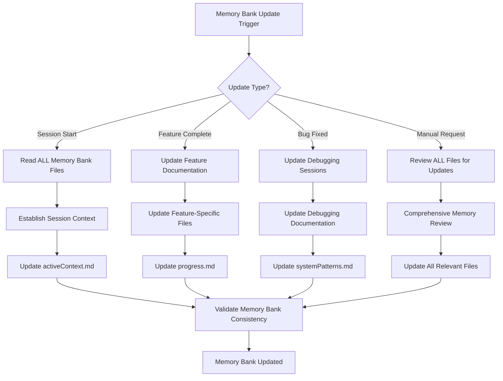
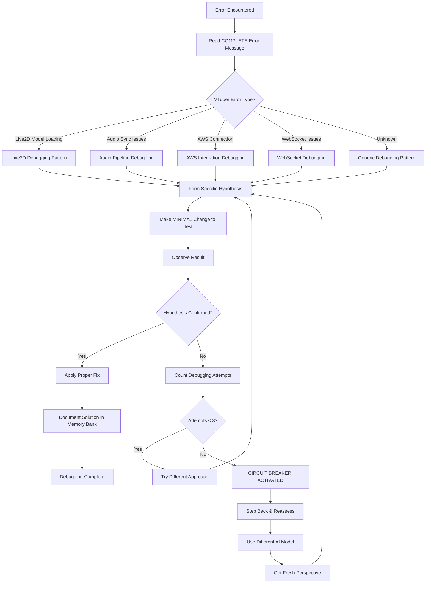
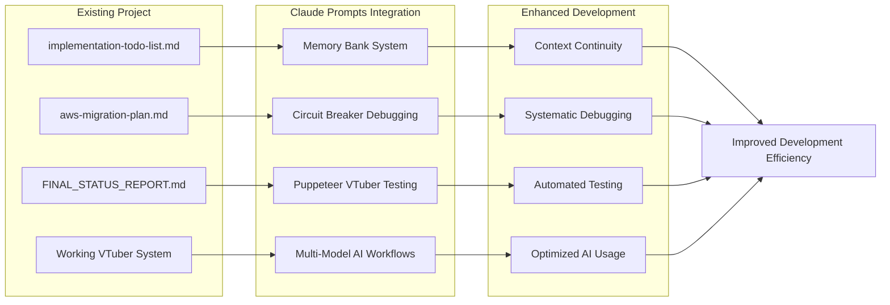
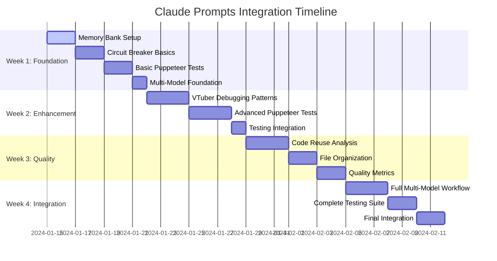

# Claude Prompts Integration Workflow Diagram

## Development Session Workflow

## VTuber-Specific Testing Workflow

## Multi-Model AI Integration Workflow

## Memory Bank Update Workflow

## Circuit Breaker Debugging Workflow

## Integration Points with Existing Project

## Implementation Timeline

## Success Metrics Dashboard

```mermaid
flowchart TD
    Metrics[Success Metrics] --> Technical[Technical Metrics]
    Metrics --> Quality[Quality Metrics]
    Metrics --> Process[Process Metrics]
    
    Technical --> MemoryUsage[Memory Bank Usage: 100%]
    Technical --> DebugEfficiency[Debug Efficiency: +50%]
    Technical --> CodeReuse[Code Reuse Rate: 80%]
    Technical --> TestCoverage[Test Coverage: 90%+]
    
    Quality --> BugReduction[Bug Reduction: 70%]
    Quality --> DevSpeed[Development Speed: +40%]
    Quality --> Documentation[Documentation Quality: Complete]
    Quality --> MultiModelSuccess[Multi-Model Integration: Success]
    
    Process --> SessionStart[Sessions Start with Memory: 100%]
    Process --> CircuitBreakerUse[Circuit Breaker Usage: Active]
    Process --> AutomatedTesting[Automated Testing: Operational]
    Process --> AIOptimization[AI Model Optimization: Implemented]
```

This workflow diagram shows how the Claude Prompts best practices integrate seamlessly with your existing AWS VTuber LLM development process, enhancing rather than replacing your current excellent work.