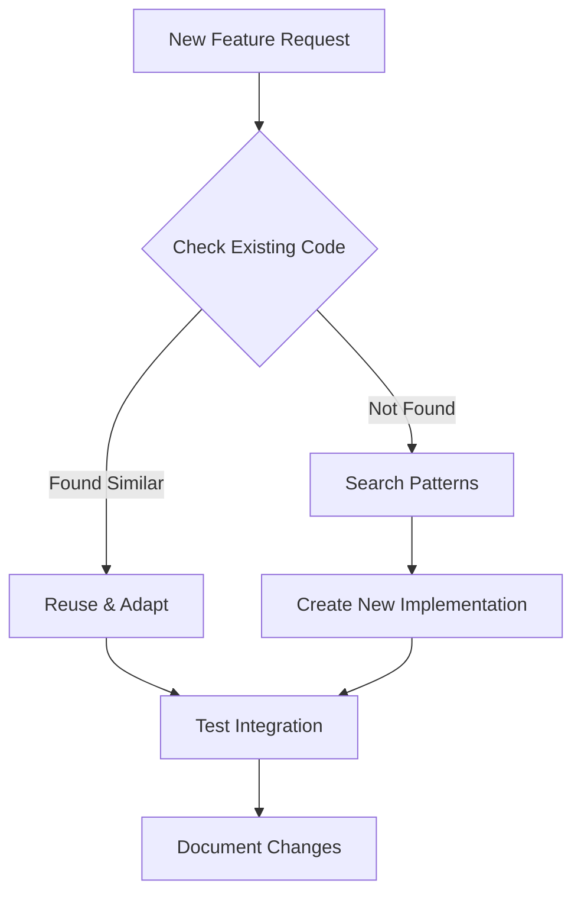
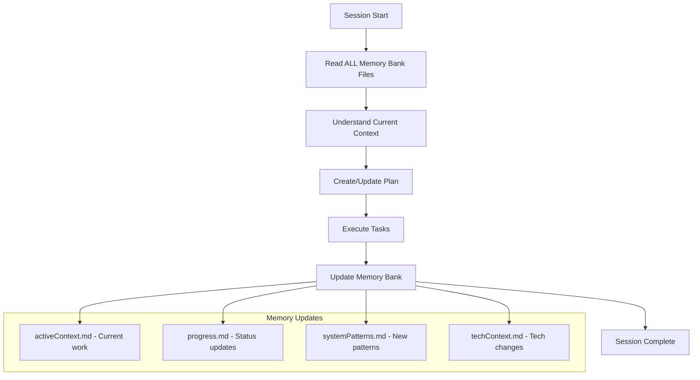
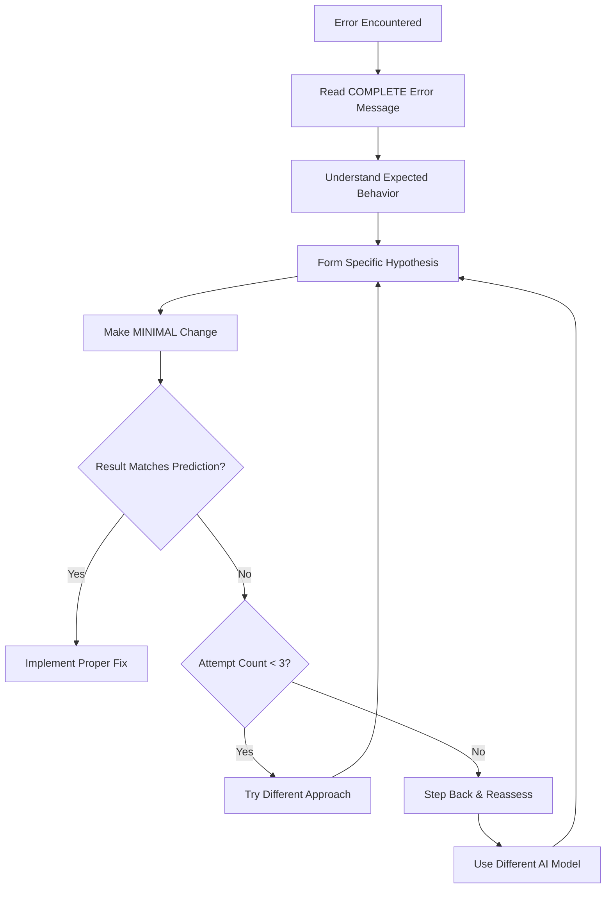
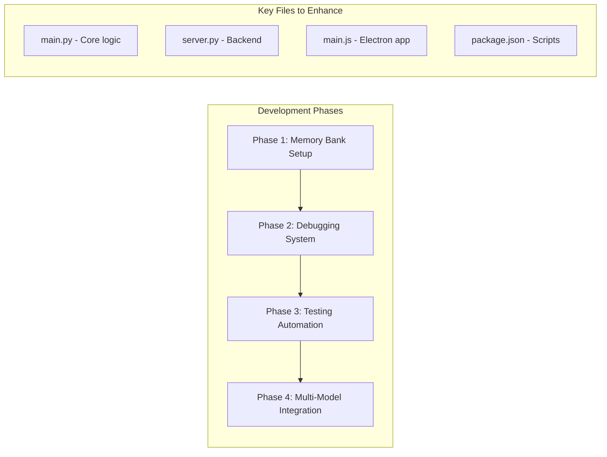

# Comprehensive Development Workflow Plan
## Based on Claude Prompts & Best Practices

### Project Context Analysis

**Current Project**: LLM Live2D Desktop Assistant
- **Architecture**: Hybrid Electron + Python backend with AWS Claude integration
- **Tech Stack**: Node.js/Electron frontend, Python backend, Live2D models, AWS Bedrock
- **Key Components**: ASR, TTS, Live2D rendering, WebSocket communication

**Reference Projects**: 
- Inkmortal Local LLM Server (from Claude prompts)
- Current VTuber assistant implementation

---

## 1. Core Development Principles

### 1.1 Code Reuse & Efficiency


**Implementation Rules**:
- **ALWAYS** search codebase before creating new functions
- **NO** "v2", "new", "old" file naming conventions
- **Files up to 800 lines** are acceptable
- **Replace existing files** instead of creating duplicates

### 1.2 Multi-Model AI Assistance Strategy

**Model Selection Matrix**:
| Task Type | Primary Model | Use Case |
|-----------|---------------|----------|
| Architecture & Planning | Gemini 2.5-Pro | System design, workflow planning |
| Code Implementation | GPT-5 | Specific feature coding, algorithms |
| Analysis & Debugging | Claude | Code review, bug analysis, context understanding |

**Zen MCP Integration**:
```javascript
// Architecture planning
await mcp__zen__chat({
  model: "gemini-2.5-pro",
  prompt: "Design system architecture for Live2D integration",
  files: ["main.py", "package.json"]
});

// Implementation
await mcp__zen__chat({
  model: "gpt-5", 
  prompt: "Implement WebSocket audio streaming",
  files: ["server.py", "main.js"]
});
```

---

## 2. Memory Bank System Implementation

### 2.1 Memory Bank Structure
```
memory-bank/
├── projectbrief.md          # Foundation document
├── productContext.md        # Project purpose & goals
├── activeContext.md         # Current work focus
├── systemPatterns.md        # Architecture patterns
├── techContext.md          # Technology stack details
├── progress.md             # Development status
└── features/               # Feature-specific docs
    ├── live2d-integration.md
    ├── aws-claude-setup.md
    └── audio-pipeline.md
```

### 2.2 Memory Bank Workflow


---

## 3. Systematic Debugging Workflow

### 3.1 Three-Strike Rule Implementation
```python
class DebuggingCircuitBreaker:
    def __init__(self, max_attempts=3):
        self.attempts = {}
        self.max_attempts = max_attempts
        
    def should_continue(self, approach):
        self.attempts[approach] = self.attempts.get(approach, 0) + 1
        if self.attempts[approach] >= self.max_attempts:
            return False, f"Tried {approach} {self.max_attempts} times. Try different approach."
        return True, "Continue"
        
    def log_attempt(self, approach, result):
        print(f"Attempt {self.attempts.get(approach, 0)}: {approach} -> {result}")
```

### 3.2 Debugging Phase Workflow


---

## 4. Automated Testing Strategy

### 4.1 Puppeteer Self-Testing Integration
```javascript
// Test workflow for Live2D Desktop Assistant
class AutomatedTestSuite {
    async runFullTestSuite() {
        // 1. Setup and Navigation
        await this.setupErrorCapture();
        await this.navigateToApp();
        
        // 2. Authentication Testing
        await this.testAdminLogin();
        
        // 3. Core Feature Testing
        await this.testLive2DRendering();
        await this.testAudioPipeline();
        await this.testClaudeIntegration();
        
        // 4. Error Detection
        await this.checkForErrors();
    }
    
    async setupErrorCapture() {
        await mcp__puppeteer__puppeteer_evaluate({
            script: `
                window.__capturedErrors = [];
                window.addEventListener('error', e => 
                    window.__capturedErrors.push(e.message)
                );
            `
        });
    }
}
```

### 4.2 Testing Efficiency Guidelines
- **Session Persistence**: Login once, test multiple features
- **Minimal Screenshots**: Only at critical verification points
- **JavaScript Evaluation**: Use for checks instead of screenshots
- **Batch Testing**: Multiple features per session

---

## 5. Project-Specific Implementation Plan

### 5.1 Current Project Integration Points

**Live2D Desktop Assistant Workflow**:


### 5.2 Immediate Action Items

1. **Create Memory Bank Structure**
   ```bash
   mkdir memory-bank
   mkdir memory-bank/features
   # Create core memory files based on current project state
   ```

2. **Implement Debugging Circuit Breaker**
   - Add to Python backend debugging utilities
   - Integrate with existing diagnostic scripts

3. **Setup Puppeteer Testing**
   - Configure for Electron app testing
   - Create test suites for Live2D rendering
   - Test AWS Claude integration endpoints

4. **Multi-Model Integration**
   - Setup Zen MCP for architecture decisions
   - Use Gemini for system design
   - Use GPT for implementation tasks

---

## 6. Development Commands & Scripts

### 6.1 Enhanced Package.json Scripts
```json
{
  "scripts": {
    "dev:full": "concurrently \"npm run dev:backend\" \"npm run dev:frontend\" \"npm run test:watch\"",
    "test:puppeteer": "node tests/puppeteer-suite.js",
    "debug:circuit-breaker": "python debug_with_circuit_breaker.py",
    "memory:update": "node scripts/update-memory-bank.js",
    "lint:check": "npm run lint && npm run typecheck",
    "validate:all": "npm run validate-models && npm run test && npm run lint:check"
  }
}
```

### 6.2 Development Workflow Commands
```bash
# Start development with full monitoring
npm run dev:full

# Run comprehensive testing
npm run test:puppeteer

# Update memory bank after major changes
npm run memory:update

# Validate entire codebase
npm run validate:all
```

---

## 7. Quality Assurance Checklist

### 7.1 Before Each Commit
- [ ] Check for existing similar functionality
- [ ] Run circuit breaker debugging if issues found
- [ ] Update relevant memory bank files
- [ ] Run automated test suite
- [ ] Verify no "v2/new/old" file naming

### 7.2 Before Each Release
- [ ] Full Puppeteer test suite passes
- [ ] Memory bank is up to date
- [ ] All debugging documentation updated
- [ ] Multi-model consultation completed for major features
- [ ] Performance benchmarks meet requirements

---

## 8. Integration with Existing Project

### 8.1 File Enhancement Strategy
Instead of creating new files, enhance existing ones:

**Target Files for Enhancement**:
- `main.py` → Add circuit breaker debugging
- `server.py` → Add memory bank integration
- `main.js` → Add Puppeteer test hooks
- `package.json` → Add new workflow scripts

### 8.2 Gradual Implementation
1. **Week 1**: Memory bank setup and documentation
2. **Week 2**: Debugging system integration
3. **Week 3**: Puppeteer testing implementation
4. **Week 4**: Multi-model workflow integration

---

## Conclusion

This comprehensive workflow plan integrates the Claude prompt best practices with the existing LLM Live2D Desktop Assistant project, providing:

- **Systematic debugging** to prevent infinite loops
- **Memory continuity** across development sessions
- **Automated testing** for reliable development
- **Multi-model AI assistance** for optimal results
- **Code reuse principles** for efficient development

The plan respects the existing project structure while enhancing it with proven development methodologies from the Claude prompt guidelines.