# Object Recognition Vision System Plan
## AI-Powered Item Identification & Analysis Assistant

### Executive Summary

This plan outlines the development of an intelligent object recognition system that enables your VTuber to identify and analyze physical items shown to the camera. The system combines computer vision, vector databases, and Claude's multimodal capabilities to provide expert-level analysis of objects like damaged tires, electronic devices, tools, and more.

**Key Capabilities:**
- 🔍 Real-time object identification and analysis
- 📚 Vector database integration for expert knowledge retrieval
- 🛠️ Specialized analysis (repairability, identification, troubleshooting)
- 💰 Cost-effective: ~$0.15/query for complex analysis
- 🎯 High accuracy through multi-stage processing pipeline
- 📱 Support for various object categories (automotive, electronics, tools, etc.)

---

## Use Case Examples

### Automotive Diagnostics
```
User: "Is this tire repairable?"
System: 
1. Captures image of tire with nail
2. Identifies: "Tire with puncture damage"
3. Retrieves: Vector DB knowledge about tire repair standards
4. Analysis: "This puncture is in the tread area, 6mm from sidewall. 
   According to industry standards, this is repairable using a 
   patch-plug combination. Estimated repair cost: $25-40."
```

### Electronics Identification
```
User: "What phone is this?"
System:
1. Captures image of smartphone
2. Identifies: Visual features, ports, camera layout
3. Retrieves: Device database with specifications
4. Analysis: "This appears to be an iPhone 14 Pro based on the 
   triple camera system and notch design. Released September 2022,
   features A16 Bionic chip, 6.1" display."
```

### Tool Recognition
```
User: "How do I use this tool?"
System:
1. Captures image of unknown tool
2. Identifies: "Torque wrench, click-type, 1/2" drive"
3. Retrieves: Tool usage instructions and safety guidelines
4. Analysis: "This is a click-type torque wrench. Set desired torque
   on the handle, apply steady pressure until you hear/feel the click.
   Always pull, never push. Typical range: 10-150 ft-lbs."
```

---

## Enhanced Architecture

### System Flow

```mermaid
graph TB
    subgraph "Capture & Processing"
        USER[👤 User Shows Object] --> CAM[📷 Webcam Capture]
        CAM --> DETECT[Object Detection]
        DETECT --> CROP[Smart Cropping]
        CROP --> ENHANCE[Image Enhancement]
    end

    subgraph "AI Analysis Pipeline"
        ENHANCE --> CLAUDE[Claude Vision Analysis]
        CLAUDE --> EXTRACT[Feature Extraction]
        EXTRACT --> EMBED[Generate Embeddings]
    end

    subgraph "Knowledge Retrieval"
        EMBED --> VECTOR[Vector Database Search]
        VECTOR --> KNOWLEDGE[Retrieve Expert Knowledge]
        KNOWLEDGE --> CONTEXT[Contextual Information]
    end

    subgraph "Response Generation"
        CONTEXT --> SYNTHESIS[Knowledge Synthesis]
        CLAUDE --> SYNTHESIS
        SYNTHESIS --> RESPONSE[Expert Analysis Response]
        RESPONSE --> TTS[Text-to-Speech]
        TTS --> USER
    end

    style CLAUDE fill:#99ccff
    style VECTOR fill:#99ff99
    style RESPONSE fill:#ffcc99
```


### Vector Database Architecture


---

## Technical Implementation

### Phase 1: Enhanced Vision Capture (Week 1)

#### 1.1 Smart Object Detection
```javascript
// static/desktop/object-detector.js
class ObjectDetector {
  constructor() {
    this.captureMode = 'object-focused';
    this.detectionThreshold = 0.7;
    this.cropPadding = 50; // pixels around detected object
  }

  async detectAndCrop(imageData) {
    // Use basic edge detection to find object boundaries
    const canvas = document.createElement('canvas');
    const ctx = canvas.getContext('2d');
    
    // Load image
    const img = new Image();
    img.src = imageData;
    
    await new Promise(resolve => img.onload = resolve);
    
    canvas.width = img.width;
    canvas.height = img.height;
    ctx.drawImage(img, 0, 0);
    
    // Simple object detection using contrast analysis
    const bounds = this.findObjectBounds(ctx, img.width, img.height);
    
    // Crop to object with padding
    const croppedCanvas = this.cropToObject(ctx, bounds);
    
    return croppedCanvas.toDataURL('image/jpeg', 0.8);
  }

  findObjectBounds(ctx, width, height) {
    const imageData = ctx.getImageData(0, 0, width, height);
    const data = imageData.data;
    
    let minX = width, minY = height, maxX = 0, maxY = 0;
    
    // Simple edge detection algorithm
    for (let y = 1; y < height - 1; y++) {
      for (let x = 1; x < width - 1; x++) {
        const idx = (y * width + x) * 4;
        
        // Calculate gradient magnitude
        const gx = Math.abs(data[idx] - data[idx - 4]) + 
                   Math.abs(data[idx + 4] - data[idx]);
        const gy = Math.abs(data[idx] - data[idx - width * 4]) + 
                   Math.abs(data[idx + width * 4] - data[idx]);
        
        const gradient = Math.sqrt(gx * gx + gy * gy);
        
        if (gradient > 50) { // Edge threshold
          minX = Math.min(minX, x);
          minY = Math.min(minY, y);
          maxX = Math.max(maxX, x);
          maxY = Math.max(maxY, y);
        }
      }
    }
    
    return {
      x: Math.max(0, minX - this.cropPadding),
      y: Math.max(0, minY - this.cropPadding),
      width: Math.min(width, maxX - minX + 2 * this.cropPadding),
      height: Math.min(height, maxY - minY + 2 * this.cropPadding)
    };
  }
}
```

#### 1.2 Enhanced Image Processing
```javascript
// static/desktop/image-enhancer.js
class ImageEnhancer {
  constructor() {
    this.contrastBoost = 1.2;
    this.brightnessAdjust = 10;
    this.sharpening = true;
  }

  async enhanceForAnalysis(imageData) {
    const canvas = document.createElement('canvas');
    const ctx = canvas.getContext('2d');
    
    const img = new Image();
    img.src = imageData;
    await new Promise(resolve => img.onload = resolve);
    
    canvas.width = img.width;
    canvas.height = img.height;
    
    // Apply enhancements
    ctx.filter = `contrast(${this.contrastBoost}) brightness(${1 + this.brightnessAdjust/100})`;
    ctx.drawImage(img, 0, 0);
    
    if (this.sharpening) {
      this.applySharpeningFilter(ctx, canvas.width, canvas.height);
    }
    
    return canvas.toDataURL('image/jpeg', 0.9);
  }

  applySharpeningFilter(ctx, width, height) {
    // Simple unsharp mask implementation
    const imageData = ctx.getImageData(0, 0, width, height);
    const data = imageData.data;
    const sharpened = new Uint8ClampedArray(data);
    
    const kernel = [
      0, -1, 0,
      -1, 5, -1,
      0, -1, 0
    ];
    
    for (let y = 1; y < height - 1; y++) {
      for (let x = 1; x < width - 1; x++) {
        for (let c = 0; c < 3; c++) { // RGB channels
          let sum = 0;
          for (let ky = -1; ky <= 1; ky++) {
            for (let kx = -1; kx <= 1; kx++) {
              const idx = ((y + ky) * width + (x + kx)) * 4 + c;
              sum += data[idx] * kernel[(ky + 1) * 3 + (kx + 1)];
            }
          }
          sharpened[(y * width + x) * 4 + c] = Math.max(0, Math.min(255, sum));
        }
      }
    }
    
    const newImageData = new ImageData(sharpened, width, height);
    ctx.putImageData(newImageData, 0, 0);
  }
}
```

### Phase 2: Vector Database Integration (Week 2)

#### 2.1 AWS OpenSearch Setup
```python
# aws/vector_database.py
import boto3
import json
from opensearchpy import OpenSearch, RequestsHttpConnection
from aws_requests_auth.aws_auth import AWSRequestsAuth

class VectorKnowledgeBase:
    def __init__(self, config):
        self.region = config.get('AWS_REGION', 'us-west-2')
        self.opensearch_endpoint = config.get('OPENSEARCH_ENDPOINT')
        self.index_name = 'object-knowledge-base'
        
        # Initialize OpenSearch client
        host = self.opensearch_endpoint.replace('https://', '')
        awsauth = AWSRequestsAuth(
            aws_access_key=config.get('AWS_ACCESS_KEY_ID'),
            aws_secret_access_key=config.get('AWS_SECRET_ACCESS_KEY'),
            aws_token=config.get('AWS_SESSION_TOKEN'),
            aws_host=host,
            aws_region=self.region,
            aws_service='es'
        )
        
        self.client = OpenSearch(
            hosts=[{'host': host, 'port': 443}],
            http_auth=awsauth,
            use_ssl=True,
            verify_certs=True,
            connection_class=RequestsHttpConnection
        )
    
    async def search_similar_objects(self, query_embedding, object_category=None, limit=5):
        """Search for similar objects using vector similarity"""
        search_body = {
            "size": limit,
            "query": {
                "bool": {
                    "must": [
                        {
                            "knn": {
                                "embedding_vector": {
                                    "vector": query_embedding,
                                    "k": limit
                                }
                            }
                        }
                    ]
                }
            },
            "_source": ["title", "description", "category", "repair_info", "specifications", "safety_notes"]
        }
        
        # Add category filter if specified
        if object_category:
            search_body["query"]["bool"]["filter"] = [
                {"term": {"category": object_category}}
            ]
        
        response = self.client.search(
            index=self.index_name,
            body=search_body
        )
        
        return [hit["_source"] for hit in response["hits"]["hits"]]
    
    async def get_repair_procedures(self, object_type, damage_type):
        """Get specific repair procedures for object and damage type"""
        search_body = {
            "query": {
                "bool": {
                    "must": [
                        {"match": {"object_type": object_type}},
                        {"match": {"damage_type": damage_type}}
                    ]
                }
            }
        }
        
        response = self.client.search(
            index="repair-procedures",
            body=search_body
        )
        
        return [hit["_source"] for hit in response["hits"]["hits"]]
```

#### 2.2 Knowledge Base Population
```python
# scripts/populate_knowledge_base.py
import json
import asyncio
from vector_database import VectorKnowledgeBase

class KnowledgeBasePopulator:
    def __init__(self):
        self.knowledge_base = VectorKnowledgeBase()
        
    async def populate_automotive_knowledge(self):
        """Populate with automotive repair knowledge"""
        automotive_data = [
            {
                "id": "tire_puncture_tread",
                "title": "Tire Puncture in Tread Area",
                "category": "automotive",
                "object_type": "tire",
                "damage_type": "puncture",
                "description": "Puncture damage in the tire tread area",
                "repair_info": {
                    "repairable": True,
                    "conditions": [
                        "Puncture diameter < 6mm",
                        "Located in tread area",
                        "No sidewall damage",
                        "Tire not run flat"
                    ],
                    "procedure": "Patch-plug combination repair",
                    "cost_range": "$25-40",
                    "time_required": "30-45 minutes"
                },
                "safety_notes": [
                    "Do not repair if puncture is in sidewall",
                    "Check for internal damage before repair",
                    "Replace if multiple punctures within 16 inches"
                ],
                "embedding_vector": [0.1, 0.2, 0.3, ...] # Generated by embedding model
            },
            {
                "id": "tire_sidewall_damage",
                "title": "Tire Sidewall Damage",
                "category": "automotive",
                "object_type": "tire",
                "damage_type": "sidewall_damage",
                "description": "Damage to tire sidewall area",
                "repair_info": {
                    "repairable": False,
                    "reason": "Sidewall repairs are unsafe and not recommended",
                    "recommendation": "Replace tire immediately",
                    "cost_range": "$100-300",
                    "urgency": "high"
                },
                "safety_notes": [
                    "Sidewall damage can cause sudden tire failure",
                    "Do not drive on damaged sidewall",
                    "Replace both tires on same axle if wear difference > 2/32\""
                ]
            }
        ]
        
        for item in automotive_data:
            await self.knowledge_base.index_document(item)
    
    async def populate_electronics_knowledge(self):
        """Populate with electronics identification data"""
        electronics_data = [
            {
                "id": "iphone_14_pro",
                "title": "Apple iPhone 14 Pro",
                "category": "electronics",
                "object_type": "smartphone",
                "brand": "Apple",
                "model": "iPhone 14 Pro",
                "description": "Premium smartphone with triple camera system",
                "specifications": {
                    "display": "6.1\" Super Retina XDR OLED",
                    "processor": "A16 Bionic chip",
                    "cameras": "48MP main, 12MP ultra-wide, 12MP telephoto",
                    "storage": "128GB, 256GB, 512GB, 1TB",
                    "release_date": "September 2022",
                    "price_range": "$999-1499"
                },
                "identifying_features": [
                    "Triple camera system with larger main sensor",
                    "Dynamic Island instead of notch",
                    "Titanium frame (Pro models)",
                    "Lightning connector",
                    "Face ID"
                ],
                "troubleshooting": {
                    "common_issues": [
                        "Battery drain",
                        "Camera app crashes",
                        "Overheating during charging"
                    ],
                    "solutions": [
                        "Update to latest iOS version",
                        "Reset camera settings",
                        "Use MagSafe charger in cool environment"
                    ]
                }
            }
        ]
        
        for item in electronics_data:
            await self.knowledge_base.index_document(item)
```

### Phase 3: Enhanced Claude Integration (Week 2-3)

#### 3.1 Multimodal Analysis Pipeline
```python
# module/object_analyzer.py
import base64
import json
from typing import Dict, List, Optional
import boto3
from vector_database import VectorKnowledgeBase

class ObjectAnalyzer:
    def __init__(self, config):
        self.config = config
        self.bedrock = boto3.client('bedrock-runtime', region_name=config.get('AWS_REGION'))
        self.knowledge_base = VectorKnowledgeBase(config)
        self.model_id = 'anthropic.claude-3-5-sonnet-20241022-v2:0'
    
    async def analyze_object(self, image_data: str, user_question: str) -> Dict:
        """Complete object analysis pipeline"""
        
        # Step 1: Initial vision analysis with Claude
        initial_analysis = await self.get_initial_analysis(image_data, user_question)
        
        # Step 2: Extract key features for vector search
        search_terms = self.extract_search_terms(initial_analysis)
        
        # Step 3: Search knowledge base for relevant information
        knowledge_results = await self.search_knowledge_base(search_terms)
        
        # Step 4: Generate comprehensive response
        final_response = await self.generate_expert_response(
            image_data, user_question, initial_analysis, knowledge_results
        )
        
        return {
            'analysis': final_response,
            'confidence': self.calculate_confidence(initial_analysis, knowledge_results),
            'knowledge_sources': len(knowledge_results),
            'category': search_terms.get('category', 'unknown')
        }
    
    async def get_initial_analysis(self, image_data: str, user_question: str) -> Dict:
        """Get initial object identification from Claude Vision"""
        
        prompt = f"""
        Analyze this image and answer the user's question: "{user_question}"
        
        Please provide:
        1. Object identification (what is this item?)
        2. Key visual features you can observe
        3. Condition assessment (if applicable)
        4. Category classification (automotive, electronics, tools, etc.)
        5. Any damage or notable characteristics
        
        Be specific and detailed in your observations.
        """
        
        messages = [{
            "role": "user",
            "content": [
                {"type": "text", "text": prompt},
                {
                    "type": "image",
                    "source": {
                        "type": "base64",
                        "media_type": "image/jpeg",
                        "data": image_data
                    }
                }
            ]
        }]
        
        response = self.bedrock.invoke_model(
            modelId=self.model_id,
            body=json.dumps({
                "anthropic_version": "bedrock-2023-05-31",
                "max_tokens": 1000,
                "messages": messages
            })
        )
        
        result = json.loads(response['body'].read())
        return {
            'description': result['content'][0]['text'],
            'raw_response': result
        }
    
    def extract_search_terms(self, analysis: Dict) -> Dict:
        """Extract key terms for vector database search"""
        description = analysis['description'].lower()
        
        # Simple keyword extraction (could be enhanced with NLP)
        categories = {
            'automotive': ['tire', 'car', 'vehicle', 'engine', 'brake', 'wheel'],
            'electronics': ['phone', 'smartphone', 'tablet', 'laptop', 'device', 'screen'],
            'tools': ['wrench', 'screwdriver', 'hammer', 'drill', 'saw', 'pliers'],
            'appliance': ['refrigerator', 'washer', 'dryer', 'microwave', 'oven']
        }
        
        detected_category = None
        for category, keywords in categories.items():
            if any(keyword in description for keyword in keywords):
                detected_category = category
                break
        
        # Extract object type and condition
        object_type = self.extract_object_type(description)
        condition = self.extract_condition(description)
        
        return {
            'category': detected_category,
            'object_type': object_type,
            'condition': condition,
            'description': description
        }
    
    async def search_knowledge_base(self, search_terms: Dict) -> List[Dict]:
        """Search vector database for relevant knowledge"""
        
        # Generate embedding for search query
        query_text = f"{search_terms.get('object_type', '')} {search_terms.get('condition', '')} {search_terms.get('description', '')}"
        
        # Use Claude to generate embedding (or use dedicated embedding model)
        embedding = await self.generate_embedding(query_text)
        
        # Search knowledge base
        results = await self.knowledge_base.search_similar_objects(
            embedding, 
            object_category=search_terms.get('category'),
            limit=5
        )
        
        return results
    
    async def generate_expert_response(self, image_data: str, user_question: str, 
                                     initial_analysis: Dict, knowledge_results: List[Dict]) -> str:
        """Generate comprehensive expert response using all available information"""
        
        # Compile knowledge context
        knowledge_context = "\n\n".join([
            f"Knowledge Source {i+1}:\n{json.dumps(result, indent=2)}"
            for i, result in enumerate(knowledge_results[:3])  # Limit to top 3 results
        ])
        
        expert_prompt = f"""
        You are an expert technician with access to comprehensive knowledge databases.
        
        User Question: "{user_question}"
        
        Initial Analysis: {initial_analysis['description']}
        
        Relevant Knowledge Base Information:
        {knowledge_context}
        
        Based on the image, your initial analysis, and the knowledge base information, provide a comprehensive expert response that:
        
        1. Clearly identifies the object
        2. Addresses the user's specific question
        3. Provides technical details and specifications when relevant
        4. Includes repair/troubleshooting information if applicable
        5. Mentions safety considerations
        6. Gives cost estimates when appropriate
        7. Suggests next steps or recommendations
        
        Be authoritative but accessible, and cite specific technical standards or procedures when available.
        """
        
        messages = [{
            "role": "user",
            "content": [
                {"type": "text", "text": expert_prompt},
                {
                    "type": "image",
                    "source": {
                        "type": "base64",
                        "media_type": "image/jpeg",
                        "data": image_data
                    }
                }
            ]
        }]
        
        response = self.bedrock.invoke_model(
            modelId=self.model_id,
            body=json.dumps({
                "anthropic_version": "bedrock-2023-05-31",
                "max_tokens": 1500,
                "messages": messages
            })
        )
        
        result = json.loads(response['body'].read())
        return result['content'][0]['text']
```

### Phase 4: UI/UX Enhancements (Week 3)

#### 4.1 Object Analysis Interface
```javascript
// static/desktop/object-analysis-ui.js
class ObjectAnalysisUI {
  constructor() {
    this.analysisInProgress = false;
    this.lastAnalysis = null;
    this.confidenceThreshold = 0.7;
  }

  createAnalysisInterface() {
    const container = document.createElement('div');
    container.id = 'object-analysis-container';
    container.innerHTML = `
      <div class="analysis-controls">
        <button id="analyze-object-btn" class="primary-btn">
          🔍 Analyze Object
        </button>
        <button id="retake-photo-btn" class="secondary-btn">
          📷 Retake Photo
        </button>
        <div id="analysis-status" class="status-indicator">
          Ready to analyze
        </div>
      </div>
      
      <div id="analysis-preview" class="preview-container">
        <canvas id="object-preview-canvas"></canvas>
        <div id="detection-overlay" class="overlay"></div>
      </div>
      
      <div id="analysis-results" class="results-container hidden">
        <div class="result-header">
          <h3 id="object-title">Analysis Results</h3>
          <div id="confidence-score" class="confidence-badge"></div>
        </div>
        <div id="analysis-content" class="content-area"></div>
        <div class="action-buttons">
          <button id="get-more-info-btn">📚 More Details</button>
          <button id="save-analysis-btn">💾 Save Analysis</button>
        </div>
      </div>
    `;
    
    document.body.appendChild(container);
    this.bindEvents();
  }

  bindEvents() {
    document.getElementById('analyze-object-btn').addEventListener('click', () => {
      this.startObjectAnalysis();
    });
    
    document.getElementById('retake-photo-btn').addEventListener('click', () => {
      this.retakePhoto();
    });
    
    document.getElementById('get-more-info-btn').addEventListener('click', () => {
      this.requestMoreInformation();
    });
  }

  async startObjectAnalysis() {
    if (this.analysisInProgress) return;
    
    this.analysisInProgress = true;
    this.updateStatus('Capturing image...', 'processing');
    
    try {
      // Capture and enhance image
      const rawImage = await window.webcamManager.captureFrame();
      const detectedObject = await window.objectDetector.detectAndCrop(rawImage);
      const enhancedImage = await window.imageEnhancer.enhanceForAnalysis(detectedObject);
      
      // Show preview
      this.showImagePreview(enhancedImage);
      this.updateStatus('Analyzing object...', 'processing');
      
      // Send for analysis
      const analysisResult = await this.sendForAnalysis(enhancedImage);
      
      // Display results
      this.displayAnalysisResults(analysisResult);
      this.updateStatus('Analysis complete', 'success');
      
    } catch (error) {
      console.error('Analysis failed:', error);
      this.updateStatus('Analysis failed', 'error');
    } finally {
      this.analysisInProgress = false;
    }
  }

  async sendForAnalysis(imageData) {
    // Get user's question from voice or text input
    const userQuestion = await this.getUserQuestion();
    
    // Send via WebSocket to backend
    return new Promise((resolve, reject) => {
      const analysisId = Date.now().toString();
      
      // Listen for response
      const responseHandler = (event) => {
        const data = JSON.parse(event.data);
        if (data.type === 'object-analysis-result' && data.analysisId === analysisId) {
          window.removeEventListener('message', responseHandler);
          resolve(data.result);
        }
      };
      
      window.addEventListener('message', responseHandler);
      
      // Send analysis request
      if (window.ws && window.ws.readyState === WebSocket.OPEN) {
        window.ws.send(JSON.stringify({
          type: 'object-analysis-request',
          analysisId: analysisId,
          imageData: imageData,
          userQuestion: userQuestion,
          timestamp: Date.now()
        }));
      } else {
        reject(new Error('WebSocket not connected'));
      }
      
      // Timeout after 30 seconds
      setTimeout(() => {
        window.removeEventListener('message', responseHandler);
        reject(new Error('Analysis timeout'));
      }, 30000);
    });
  }

  displayAnalysisResults(result) {
    const resultsContainer = document.getElementById('analysis-results');
    const titleElement = document.getElementById('object-title');
    const confidenceElement = document.getElementById('confidence-score');
    const contentElement = document.getElementById('analysis-content');
    
    // Update title and confidence
    titleElement.textContent = result.category || 'Object Analysis';
    confidenceElement.textContent = `${Math.round(result.confidence * 100)}% confidence`;
    confidenceElement.className = `confidence-badge ${this.getConfidenceClass(result.confidence)}`;
    
    // Format analysis content
    contentElement.innerHTML = this.formatAnalysisContent(result.analysis);
    
    // Show results
    resultsContainer.classList.remove('hidden');
    
    // Store for future reference
    this.lastAnalysis = result;
  }

  formatAnalysisContent(analysisText) {
    // Convert analysis text to structured HTML
    const sections = analysisText.split('\n\n');
    let html = '';
    
    sections.forEach(section => {
      if (section.trim()) {
        if (section.includes(':')) {
          const [title, ...content] = section.split(':');
          html += `
            <div class="analysis-section">
              <h4>${title.trim()}</h4>
              <p>${content.join(':').trim()}</p>
            </div>
          `;
        } else {
          html += `<p class="analysis-paragraph">${section.trim()}</p>`;
        }
      }
    });
    
    return html;
  }

  getConfidenceClass(confidence) {
    if (confidence >= 0.8) return 'high-confidence';
    if (confidence >= 0.6) return 'medium-confidence';
    return 'low-confidence';
  }

  updateStatus(message, type = 'info') {
    const statusElement = document.getElementById('analysis-status');
    statusElement.textContent = message;
    statusElement.className = `status-indicator ${type}`;
  }
}
```

---

## Cost Analysis & Optimization

### Detailed Cost Breakdown
| Component | Per Request | Monthly (100 requests) |
|-----------|-------------|------------------------|
| Claude Vision Analysis | $0.048 | $4.80 |
| Vector Database Search | $0.001 | $0.10 |
| Image Processing (Lambda) | $0.0002 | $0.02 |
| OpenSearch Storage | - | $2.00 |
| **Total** | **$0.049** | **$6.92** |

### Cost Optimization Strategies
1. **Smart Caching**: Cache analysis results for identical objects
2. **Progressive Analysis**: Start with basic identification, add detail on request
3. **Batch Processing**: Group similar queries for efficiency
4. **Local Preprocessing**: Reduce image size and enhance quality locally
5. **Confidence Thresh