# AWS VTuber LLM System Architecture Flow Diagram

## Overview
This diagram illustrates the complete flow from local desktop application components through backend services to AWS cloud infrastructure for the Live2D VTuber Assistant system.

```mermaid
graph TB
    %% Local Desktop Layer
    subgraph "🖥️ LOCAL DESKTOP ENVIRONMENT"
        subgraph "Frontend Layer"
            REACT[React/Vite Frontend<br/>📁 frontend/src/]
            LIVE2D[Live2D Viewer<br/>🎭 Live2D Models & Animations]
            AUDIO_UI[Audio Controls<br/>🎤 Mic Input/Output]
            WS_CLIENT[WebSocket Client<br/>🔌 Real-time Communication]
        end
        
        subgraph "Python Backend Layer"
            MAIN_PY[main.py<br/>🐍 Core Application Entry]
            SERVER_PY[server.py<br/>🌐 FastAPI Server]
            
            subgraph "Core Modules"
                ASR[ASR Factory<br/>🎙️ Speech-to-Text<br/>Faster-Whisper/OpenAI]
                TTS[TTS Factory<br/>🔊 Text-to-Speech<br/>Edge TTS/Azure TTS]
                LLM_LOCAL[LLM Factory<br/>🧠 Local LLM Interface]
                VISION[Vision Manager<br/>👁️ Image Analysis]
                AUDIO_MGR[Audio Manager<br/>🎵 Audio Processing]
            end
        end
        
        subgraph "Configuration"
            CONFIG[app_config.json<br/>⚙️ Local Configuration]
            ENV_LOCAL[.env<br/>🔐 Environment Variables]
        end
    end

    %% Network Layer
    subgraph "🌐 NETWORK COMMUNICATION"
        HTTP_API[HTTP API Calls<br/>📡 REST Endpoints]
        WS_CONN[WebSocket Connection<br/>⚡ Real-time Bidirectional]
    end

    %% AWS Cloud Infrastructure
    subgraph "☁️ AWS CLOUD INFRASTRUCTURE"
        subgraph "API Gateway Layer"
            HTTP_GW[HTTP API Gateway<br/>🚪 https://xvalzve2ul.execute-api.us-west-2.amazonaws.com/dev]
            WS_GW[WebSocket API Gateway<br/>🔌 wss://sz0alheq5d.execute-api.us-west-2.amazonaws.com/dev]
        end
        
        subgraph "Lambda Functions"
            HEALTH_FN[Health Function<br/>❤️ /health endpoint]
            CLAUDE_FN[Claude HTTP Function<br/>🤖 /claude endpoint<br/>Bedrock Integration]
            WS_CONN_FN[WS Connections Function<br/>🔗 $connect/$disconnect]
            ORCHESTRATOR_FN[Orchestrator Function<br/>🎭 WebSocket Chat Handler]
        end
        
        subgraph "AI/ML Services"
            BEDROCK[AWS Bedrock<br/>🧠 Claude 3.7 Sonnet<br/>anthropic.claude-3-7-sonnet-20250219-v1:0]
            BEDROCK_AGENT[Bedrock Agent Runtime<br/>🔍 RAG Query Processing]
        end
        
        subgraph "Data Storage"
            S3_DOCS[S3 Documents Bucket<br/>📄 RAG Document Storage]
            DYNAMODB_CONN[DynamoDB Connections<br/>🔗 WebSocket Connection Tracking]
            DYNAMODB_SESS[DynamoDB Sessions<br/>📝 User Session Management]
        end
        
        subgraph "RAG Infrastructure (Optional)"
            OPENSEARCH[OpenSearch Domain<br/>🔍 Vector Search<br/>vtuber-vectors-dev]
            KB_ROLE[Bedrock KB Role<br/>🔐 IAM Role for Knowledge Base]
            KNOWLEDGE_BASE[Bedrock Knowledge Base<br/>📚 RAG Document Retrieval]
        end
    end

    %% Flow Connections - Local to Network
    REACT --> WS_CLIENT
    REACT --> HTTP_API
    WS_CLIENT --> WS_CONN
    AUDIO_UI --> SERVER_PY
    LIVE2D --> SERVER_PY
    
    SERVER_PY --> MAIN_PY
    MAIN_PY --> ASR
    MAIN_PY --> TTS
    MAIN_PY --> LLM_LOCAL
    MAIN_PY --> VISION
    MAIN_PY --> AUDIO_MGR
    
    CONFIG --> SERVER_PY
    ENV_LOCAL --> SERVER_PY
    
    %% Network to AWS
    HTTP_API --> HTTP_GW
    WS_CONN --> WS_GW
    
    %% AWS Internal Flow
    HTTP_GW --> HEALTH_FN
    HTTP_GW --> CLAUDE_FN
    WS_GW --> WS_CONN_FN
    WS_GW --> ORCHESTRATOR_FN
    
    CLAUDE_FN --> BEDROCK
    CLAUDE_FN --> BEDROCK_AGENT
    CLAUDE_FN --> S3_DOCS
    
    WS_CONN_FN --> DYNAMODB_CONN
    ORCHESTRATOR_FN --> DYNAMODB_CONN
    
    BEDROCK_AGENT --> KNOWLEDGE_BASE
    KNOWLEDGE_BASE --> OPENSEARCH
    KNOWLEDGE_BASE --> S3_DOCS
    KNOWLEDGE_BASE --> KB_ROLE
    
    %% Styling
    classDef localLayer fill:#e1f5fe,stroke:#01579b,stroke-width:2px
    classDef networkLayer fill:#f3e5f5,stroke:#4a148c,stroke-width:2px
    classDef awsLayer fill:#e8f5e8,stroke:#1b5e20,stroke-width:2px
    classDef aiService fill:#fff3e0,stroke:#e65100,stroke-width:2px
    classDef storage fill:#fce4ec,stroke:#880e4f,stroke-width:2px
    
    class REACT,LIVE2D,AUDIO_UI,WS_CLIENT,MAIN_PY,SERVER_PY,ASR,TTS,LLM_LOCAL,VISION,AUDIO_MGR,CONFIG,ENV_LOCAL localLayer
    class HTTP_API,WS_CONN networkLayer
    class HTTP_GW,WS_GW,HEALTH_FN,CLAUDE_FN,WS_CONN_FN,ORCHESTRATOR_FN awsLayer
    class BEDROCK,BEDROCK_AGENT,KNOWLEDGE_BASE aiService
    class S3_DOCS,DYNAMODB_CONN,DYNAMODB_SESS,OPENSEARCH,KB_ROLE storage
```



## Detailed Component Breakdown

### 🖥️ Local Desktop Environment

#### Frontend Layer
- **React/Vite Frontend**: Modern web interface built with React and TypeScript
  - Location: [`frontend/src/`](LLM-Live2D-Desktop-Assitant-main/frontend/src/)
  - Main component: [`App.tsx`](LLM-Live2D-Desktop-Assitant-main/frontend/src/App.tsx)
  - Configuration: [`api.ts`](LLM-Live2D-Desktop-Assitant-main/frontend/src/config/api.ts)

- **Live2D Viewer**: Animated character display system
  - Models: [`static/desktop/models/`](LLM-Live2D-Desktop-Assitant-main/static/desktop/models/)
  - Live2D integration: [`static/desktop/live2d.js`](LLM-Live2D-Desktop-Assitant-main/static/desktop/live2d.js)

- **Audio Controls**: Microphone input and audio output management
  - Audio Manager: [`module/audio_manager.py`](LLM-Live2D-Desktop-Assitant-main/module/audio_manager.py)

#### Python Backend Layer
- **Core Application**: [`main.py`](LLM-Live2D-Desktop-Assitant-main/main.py) - Main application orchestrator
- **FastAPI Server**: [`server.py`](LLM-Live2D-Desktop-Assitant-main/server.py) - Web server and API endpoints

#### Core Modules
- **ASR (Automatic Speech Recognition)**: [`asr/asr_factory.py`](LLM-Live2D-Desktop-Assitant-main/asr/asr_factory.py)
  - Supports: Faster-Whisper, OpenAI Whisper, WhisperCPP
- **TTS (Text-to-Speech)**: [`tts/tts_factory.py`](LLM-Live2D-Desktop-Assitant-main/tts/tts_factory.py)
  - Supports: Edge TTS, Azure TTS, Bark TTS, Coqui TTS
- **LLM Interface**: [`llm/claude.py`](LLM-Live2D-Desktop-Assitant-main/llm/claude.py) - Claude integration
- **Vision Manager**: [`module/vision_manager.py`](LLM-Live2D-Desktop-Assitant-main/module/vision_manager.py) - Image analysis

### 🌐 Network Communication

#### HTTP API Communication
- **Endpoint**: `https://xvalzve2ul.execute-api.us-west-2.amazonaws.com/dev`
- **Primary Route**: `/claude` - Main LLM interaction endpoint
- **Health Check**: `/health` - System status monitoring

#### WebSocket Communication
- **Endpoint**: `wss://sz0alheq5d.execute-api.us-west-2.amazonaws.com/dev`
- **Real-time Features**: Live chat, audio streaming, Live2D animation triggers

### ☁️ AWS Cloud Infrastructure

#### API Gateway Layer
- **HTTP API Gateway**: Routes REST API calls to appropriate Lambda functions
- **WebSocket API Gateway**: Manages persistent WebSocket connections

#### Lambda Functions (from [`template.yml`](LLM-Live2D-Desktop-Assitant-main/backend/template.yml))
1. **Health Function**: Simple health check endpoint
2. **Claude HTTP Function**: Main AI processing with Bedrock integration
   - Handles text and vision requests
   - Optional RAG document retrieval
   - Safety-critical response enhancement
3. **WS Connections Function**: Manages WebSocket connection lifecycle
4. **Orchestrator Function**: Handles real-time chat via WebSocket

#### AI/ML Services
- **AWS Bedrock**: Claude 3.7 Sonnet model hosting
  - Model ID: `anthropic.claude-3-7-sonnet-20250219-v1:0`
  - Vision capabilities for image analysis
- **Bedrock Agent Runtime**: RAG query processing and document retrieval

#### Data Storage
- **S3 Documents Bucket**: Stores RAG documents for knowledge base
- **DynamoDB Tables**:
  - Connections table: WebSocket connection tracking
  - Sessions table: User session management

#### RAG Infrastructure (Optional)
- **OpenSearch Domain**: Vector search for document similarity
- **Bedrock Knowledge Base**: Document indexing and retrieval
- **IAM Role**: Permissions for Bedrock to access S3 and OpenSearch

## Data Flow Patterns

### 1. Text Conversation Flow
```
User Input → React Frontend → FastAPI Server → HTTP API Gateway → Claude Lambda → Bedrock → Response
```

### 2. Vision Analysis Flow
```
Image Capture → Vision Manager → HTTP API Gateway → Claude Lambda (Vision) → Bedrock → Analysis Response
```

### 3. RAG-Enhanced Query Flow
```
User Query → RAG Processing → Knowledge Base → OpenSearch → Document Retrieval → Enhanced Prompt → Bedrock → Contextual Response
```

### 4. Real-time WebSocket Flow
```
User Action → WebSocket Client → WebSocket Gateway → Orchestrator Lambda → DynamoDB → Real-time Response
```

### 5. Audio Processing Flow
```
Microphone → ASR Module → Text Processing → LLM → TTS Module → Audio Output → Live2D Animation
```

## Configuration Files

### Local Configuration
- [`config/app_config.json`](LLM-Live2D-Desktop-Assitant-main/config/app_config.json): AWS endpoints and model configuration
- [`.env.example`](LLM-Live2D-Desktop-Assitant-main/.env.example): Environment variables template

### AWS Infrastructure
- [`backend/template.yml`](LLM-Live2D-Desktop-Assitant-main/backend/template.yml): CloudFormation/SAM template for AWS resources

## Key Features

### 🎭 Live2D Integration
- Real-time character animation based on conversation context
- Expression mapping from AI responses
- Interactive character behaviors

### 🧠 AI Capabilities
- **Text Conversation**: Natural language processing with Claude 3.7 Sonnet
- **Vision Analysis**: Image understanding and object recognition
- **RAG Enhancement**: Context-aware responses using document knowledge base

### 🔊 Audio Pipeline
- **Speech Recognition**: Multiple ASR engine support
- **Text-to-Speech**: Various TTS engine options
- **Audio Processing**: Real-time audio filtering and enhancement

### 🌐 Hybrid Architecture
- **Local Processing**: Audio, vision, and Live2D rendering
- **Cloud AI**: Advanced language model processing
- **Real-time Communication**: WebSocket for immediate responses

This architecture provides a scalable, modular system that combines local desktop capabilities with cloud-based AI services, enabling rich interactive experiences with the Live2D VTuber assistant.