# Vision Integration Architecture Diagram

## System Overview

```mermaid
graph TB
    subgraph "User Interface Layer"
        U[👤 User] --> CAM[📷 Webcam]
        U --> MIC[🎤 Microphone]
        CAM --> WM[WebcamManager]
        MIC --> VAD[VAD System]
    end

    subgraph "Frontend (Electron)"
        WM --> IC[Image Capture]
        VAD --> ST[Speech Trigger]
        ST --> WM
        IC --> COMP[Image Compression]
        COMP --> WS[WebSocket Client]
        
        subgraph "UI Controls"
            VUI[Vision UI Controls]
            CI[Camera Indicator]
            PS[Privacy Settings]
        end
    end

    subgraph "Backend (Python Server)"
        WS --> WSS[WebSocket Server]
        WSS --> VM[Vision Manager]
        WSS --> AM[Audio Manager]
        VM --> IP[Image Processor]
        AM --> STT[Speech-to-Text]
        
        subgraph "Conversation Pipeline"
            CM[Conversation Manager]
            VM --> CM
            STT --> CM
        end
    end

    subgraph "AWS Cloud Services"
        CM --> CC[Claude Client]
        CC --> LAMBDA[AWS Lambda]
        LAMBDA --> CLAUDE[Claude 3.5 Sonnet]
        CLAUDE --> LAMBDA
        LAMBDA --> CC
        CC --> CM
    end

    subgraph "Response Pipeline"
        CM --> TTS[Text-to-Speech]
        TTS --> AUDIO[🔊 Audio Output]
        CM --> LIVE2D[Live2D Avatar]
        LIVE2D --> VISUAL[👁️ Visual Response]
    end

    style CAM fill:#ff9999
    style CLAUDE fill:#99ccff
    style VM fill:#99ff99
    style WM fill:#ffcc99
```



## Data Flow Architecture


## Component Integration Map


## Vision Processing Pipeline

```mermaid
flowchart TD
    START([User Speaks]) --> DETECT{VAD Detects Speech?}
    DETECT -->|Yes| CAPTURE[Capture Webcam Frame]
    DETECT -->|No| WAIT[Wait for Speech]
    WAIT --> DETECT
    
    CAPTURE --> VALIDATE{Valid Image?}
    VALIDATE -->|No| ERROR[Log Error & Continue Audio-Only]
    VALIDATE -->|Yes| RESIZE[Resize to Target Resolution]
    
    RESIZE --> COMPRESS[Compress JPEG (70% quality)]
    COMPRESS --> ENCODE[Base64 Encode]
    ENCODE --> TRANSMIT[Send via WebSocket]
    
    TRANSMIT --> BACKEND[Backend Processing]
    BACKEND --> OPTIMIZE[Image Optimization]
    OPTIMIZE --> CONTEXT[Add to Conversation Context]
    
    CONTEXT --> MULTIMODAL[Create Multimodal Request]
    MULTIMODAL --> AWS[Send to AWS Claude]
    AWS --> RESPONSE[Enhanced Response]
    RESPONSE --> TTS[Generate Speech]
    TTS --> END([Audio + Visual Response])
    
    ERROR --> AUDIO_ONLY[Continue Audio-Only Mode]
    AUDIO_ONLY --> END
    
    style CAPTURE fill:#ff9999
    style AWS fill:#99ccff
    style RESPONSE fill:#99ff99
```

## Security & Privacy Architecture

```mermaid
graph TB
    subgraph "Privacy Controls"
        PC1[Camera Permission Request]
        PC2[Visual Activity Indicator]
        PC3[Privacy Mode Toggle]
        PC4[Data Retention Policy]
    end

    subgraph "Security Measures"
        SM1[Image Data Encryption]
        SM2[Secure WebSocket (WSS)]
        SM3[AWS IAM Roles]
        SM4[Rate Limiting]
        SM5[Input Validation]
    end

    subgraph "Data Flow Security"
        DF1[Local Processing] --> DF2[Encrypted Transmission]
        DF2 --> DF3[AWS Secure Processing]
        DF3 --> DF4[No Persistent Storage]
    end

    PC1 --> SM1
    PC2 --> SM2
    PC3 --> SM3
    PC4 --> SM4
    
    style PC1 fill:#FFB6C1
    style PC2 fill:#FFB6C1
    style PC3 fill:#FFB6C1
    style PC4 fill:#FFB6C1
    style SM1 fill:#98FB98
    style SM2 fill:#98FB98
    style SM3 fill:#98FB98
    style SM4 fill:#98FB98
    style SM5 fill:#98FB98
```

## Configuration Architecture


## Error Handling & Fallback Architecture


## Performance Monitoring Architecture


## Deployment Architecture


## Key Integration Points

### 1. VAD → Webcam Trigger
- **Location**: `static/desktop/vad.js` line ~89 (onSpeechStart)
- **Action**: Trigger webcam capture when speech detected
- **Data Flow**: Speech detection → Image capture → Combined processing

### 2. WebSocket Protocol Extension
- **Location**: `static/desktop/websocket.js` message handling
- **New Message Types**: 
  - `vision-data`: Image transmission
  - `vision-config`: Settings updates
  - `vision-error`: Error handling

### 3. AWS Lambda Enhancement
- **Location**: AWS Lambda function
- **Enhancement**: Multimodal request processing
- **Input**: `{text: string, image?: base64, image_type?: string}`

### 4. Configuration Integration
- **Location**: `src/config/appConfig.js`
- **New Section**: Vision configuration with defaults
- **Runtime**: Dynamic configuration updates

This architecture ensures seamless integration of vision capabilities while maintaining the existing audio pipeline's performance and reliability. The modular design allows for incremental implementation and easy maintenance.